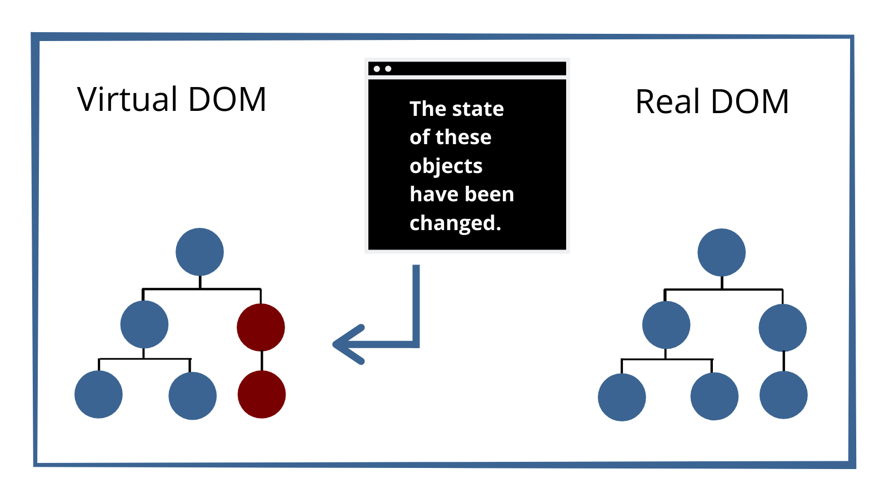
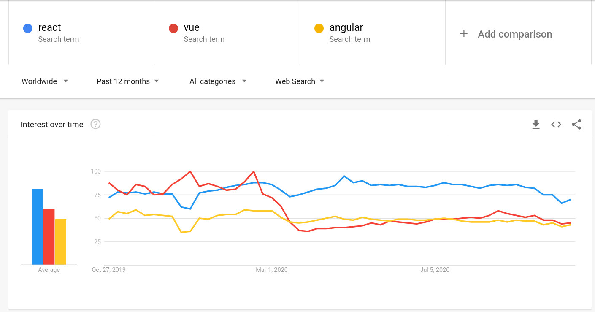

# React intro
## What is React?

​
_React was built by Jordan Walke, an engineer at Facebook._
​
* `React` is a **front-end javascript library** used to build fast and interactive **UI** on web-application.
* It is an **open-source framework** means any user can access its source code, modify it and use it.
* React is the __view__ layer of an MVC application (Model View Controller). Which is also responsible for how the application looks and feels.
​
### How React works in real-time


Take an example of _Instagram_ webpage which is *entirely built using React*. Here we have a search component, a profile description component, the stories component, and a posts list component. These components make the code easier to *debug* and always remain *discrete* as each one of them has its own *properties* and *function* to be performed. `Components also make development and maintenance of a web-application faster` as multiple developers can work simultaneously on different components of the same web-application.
​
## Why react?

​
* React helps in easy *creation of a dynamic web-application*.
* It also provides us *performance enhancements*.
* It uses *reusable components*, which helps decrease the development time.
* It involves *uni-directional flow* of data.
* It also has *small-learning curve*. In comparison to other frameworks like angular, react is much easier to learn.
* It can also be used for *mobile application* with the help of its recently released extension called _React native_ that is used to develop mobile applications with _cross-compatibility_.
* It has dedicated _tools for easy debugging_.
​
## Features of react


​
### JSX- JavaScript Syntax Extension

* JSX is an extension to javascript used with react to describe the User interface.
* It is an inline markup that looks like HTML and gets transformed to JavaScript.
* Using it, you can write HTML structure in the same file that contains JavaScript code.
* It helps in making code easier to understand & debug as it avoids usage of the rather complex structure like JS DOM.
​
> With an example of JSX, we can understand it more clearly.

```js
const simple = <h1>Hello world!</h1>;
```
* `const simple` here is a javascript notation.
* While `<h1>` tags indicates the HTML code.
* Again at the end `;` denotes ending of a JavaScript statement.
​
### Virtual DOM

* React creates a lightweight Javascript object called `Virtual DOM` in memory i.e, an exact copy of the Real DOM.
* In general, whenever anything changes in the web-application, all objects in the real DOM are updated this makes it extremely slow. But in the case of Virtual DOM, it is not so.
  > Consider an example to understand it.
  


  * Now consider two objects whose states have been changed.
  * React now compares the Virtual DOM with the Virtual DOM snapshot that was taken just before the update.
  * By comparing the new Virtual DOM with the pre-update version React will figure out exactly which Virtual DOM object has been changed.
  * Now React will update only those objects in the Virtual DOM.
  * And so makes a great difference when it comes to speed.
​
### Performance

* React uses Virtual DOM, as discussed earlier it impacts the speed of web-application.
* We also took an example of Instagram and learned how multiple components can affect the development time.
​
### One-way Data-Binding
​
Means information flows in only one direction. 
* React one-way data binding keeps everything modular and fast.
* When designing a React app you often nest child components within the parent component.
* `One-way` is one of the important ways by which we can exchange data from the component to DOM and vice-versa. `Data exchange` between the component and the view will help us to build dynamic and interactive web applications.
​
### Extensions
​
* React goes beyond simple UI and has many extensions for complete application architecture support.
* It provides server-side rendering (which means the application is rendered at the server rather than in the browser).
* React native which is a React extension is used for the development of a mobile application.
* There are many other extensions that React provides for web-development. For eg, React native, Flux, Redux
​
### Debugging
​

* React applications are extremely easy to debug due to a large developer community.
* Facebook even provides a small browser extension that makes React debugging faster and easier.
​
## React Pre-requisites

* Basic familiarity with __HTML & CSS__.
* Basic knowledge of __JavaScript and programming__.
* Basic understanding of the __DOM__.
* Familiarity with __ES6__ syntax and features.
* __Node.js__ and __npm__ installed globally.
​
## React Trends
​


* React developers earn 60% more money when compared to other web development technologies.
* React is the most in demand technology and is being adopted by all major tech companies in the world.