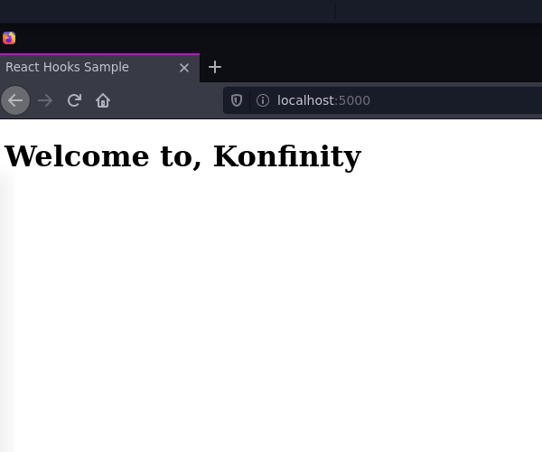
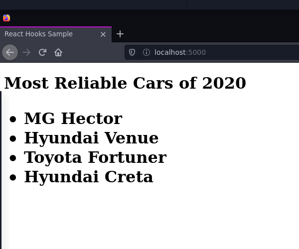
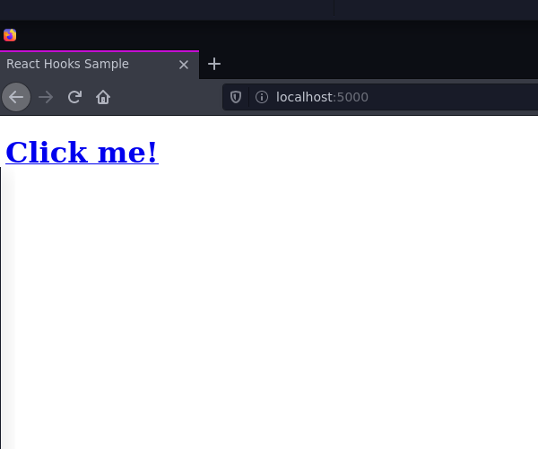

# What is JSX?

JSX is a **XML like syntax extension for JavaScript**.  
It was created by the team at Facebook and was written to be used with React.  

What does **“syntax extension”** mean?  

In this case, it means that JSX is not valid JavaScript. Web browsers can’t read it!  
If a JavaScript file contains JSX code, then that file will have to be compiled. That means that before the file reaches a web browser, a JSX compiler will translate any JSX into regular JavaScript.  
In our scenario, we already have a JSX compiler (**babel**) installed, so you don’t have to worry about that for now.

```jsx
const myElement = <h1>I am some JSX</h1>;
```
This code is neither a string nor HTML. JSX will convert this into a React element that will update our application.  

Let's take a look at more examples of JSX and how it can be used in our React applications.

## JSX Elements 
A basic unit of JSX is called a JSX element.  
Here’s an example of a JSX element:
```html
<h1>Hello world</h1>
```
This JSX element looks exactly like HTML! The only noticeable difference is that you would find it in a JavaScript file, instead of in an HTML file.

## Embedding Expressions In JSX

JSX gives you the freedom to write expressions inside curly braces. The expression can consist of variable, property or any other valid JSX expression.   

In the example below, we declare a variable 'name'. The variable is then wrapped in curly braces and used in the code.   

```jsx
import React from 'react';
import ReactDOM from 'react-dom';
const name = 'Konfinity';
const element = <h1>Welcome to, {name}</h1>;

ReactDOM.render(
  element,
  document.getElementById('root')
);
```


Just like we used the variable name, any other valid JavaScript expression like mathematical operations, methods, etc. can be used inside curly braces.  

The code below is an example of how the Javascript function can be embedded. The result of the function `Vehicles(cars)` is embedded into an ```<h1>``` tag.

```jsx
import React from 'react';
import ReactDOM from 'react-dom';
function Vehicles(cars) {
  return <ul>{carList}</ul>;
}
const cars = ['MG Hector', 'Hyundai Venue', 'Toyota Fortuner', 'Hyundai Creta'];
const carList = cars.map((car) => <li key={car.toString()}>{car}</li>);
const List = <h1>Most Reliable Cars of 2020 {Vehicles(cars)}</h1>;

ReactDOM.render(List, document.getElementById('root'));

```



## Attributes with JSX
JSX elements can have attributes, just like HTML elements can.  
A JSX attribute is written using HTML-like syntax: a name, followed by an equals sign, followed by a value. The value should be wrapped in quotes, like this:  

```
my-attribute-name="my-attribute-value"
```
Here are some JSX elements with attributes:
```jsx
<a href='http://www.maya.com'>Welcome to Maya</a>;

const title = <h1 id='title'>Introduction to JSX</h1>;
```
A single JSX element can have many attributes, just like in HTML:
```jsx
const logo = ;
```

### class vs className
In HTML, it’s common to use `class` as an attribute name:  

```html
<h1 class="big">Hey</h1>
```
In JSX, you can’t use the word `class`! You have to use `className` instead:  


```jsx
<h1 className="big">Hey</h1>
```
This is because JSX gets translated into JavaScript, and `class` is a reserved word in JavaScript.  


When JSX is rendered, JSX `className` attributes are automatically rendered as `class` attributes.


## Children with JSX

You can nest JSX elements inside of other JSX elements, just like in HTML.  
Here’s an example of a JSX < h1 > element, nested inside of a JSX < a > element:  

```jsx
<a href="https://www.example.com"><h1>Click me!</h1></a>
```
To make this more readable, you can use HTML-style line breaks and indentation:

```jsx
<a href="https://www.example.com">
  <h1>
    Click me!
  </h1>
</a>
```
If a JSX expression takes up more than one line, then you must wrap the multi-line JSX expression in parentheses. This looks strange at first, but you get used to it:  

Nested JSX expressions can be saved as variables, passed to functions, etc., just like non-nested JSX expressions can! Here’s an example of a nested JSX expression being saved as a variable:


```jsx
const theExample = (
   <a href="https://www.example.com">
     <h1>
       Click me!
     </h1>
   </a>
 );
```

