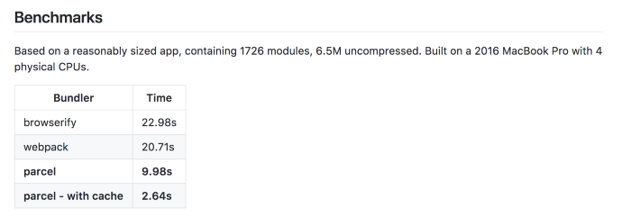

# Introduction
When it comes to web application bundling, ___ParcelJS___ is a relatively new bundler. Parcel describes itself as a __blazing fast, zero-configuration__ web application bundler. 

Parcel is based on the premise that building apps with JavaScript bundlers could be __easier__. ___Webpack___ is arguably the most popular bundler out there right now, it’s an awesome tool that gives you the power of __configurability__ but sometimes all you need is _a minimal tool that helps you get started as soon as possible_.

This is where Parcel comes in. It touts itself as __a fast bundle tool with zero configuration__—all you need to is just __point it at the entry point__ of your application. Parcel also offers the following features:

- __Fast bundle times__ - Parcel has a considerably faster time than other bundling tools out there. Below is a screenshot of the ___Parcel___ page on __Github__.



- __Assets Bundling__ - Parcel has out of the box support for JS, CSS, HTML, file assets.
- __Automatic transforms__ - All your code are automatically transformed using Babel, PostCSS, and PostHTML.
- __Code Splitting__ - Parcel allows you to split your output bundle by using the dynamic import() syntax.
- __Hot module replacement (HMR)__ - Parcel automatically updates modules in the browser as you make changes during development, no configuration needed.
- __Error Logging__ - Parcel prints syntax highlighted code frames when it encounters errors to help you pinpoint the problem.


`One other thing to note about Parcel is that it allows developers to use an index.html file as an entry point as opposed to JS modules`.

__In this tutorial, you will set up a React web app with Parcel__.
## Step 1 — Getting Started With Parcel
To get started, create a __new working directory__ and install __Parcel__ by running the command below in your terminal:
> $ **`npm install -g parcel-bundler`**

The next thing to do is create a __package.json__ file in your directory. You can do this by running the command below:
> $ **`npm init -y`**

That generates a working package.json for you.

```JSON
{
  "name": "react-parcel-demo",
  "version": "1.0.0",
  "description": "",
  "main": "index.js",
  "scripts": {
    "test": "echo \"Error: no test specified\" && exit 1"
  },
  "keywords": [],
  "author": "",
  "license": "ISC"
}
```

Parcel can take any type of file as its __entry point__, but an __HTML__ or __JavaScript__ file is a good place to start. `If you link your main JavaScript file in the HTML using a relative path, Parcel will also process it for you`. We will see it in further steps.
## Step 2 — Setting up a Project with Parcel and React
Next, you will set up a __React project with Parcel__. Before you continue, you’ll need to install some __dependencies__:

> $ **`npm i react`**

> $ **`npm i react-dom`**

The dependencies above will install __React__ and __react-dom__ in your application. Since React is written in __ES6__, we’ll need _`a way to transform the code`_. `Parcel does that for you with no need for configurations`. All you have to do is _install the_ __presets__ and Parcel does the heavy lifting for you.

> $ **`npm i babel-preset-env babel-preset-react --save-dev`**

Once that’s done, create a __.babelrc__ file and edit it with the following code:

```js
{
    "presets": ["env", "react"]
}
```
Now Babel is configured to transform _ES6/ES7 JavaScript_ into a meaningful JavaScript bundle for browsers.

Now you can begin to create the React app and its components. Open up the __index.html__ file and add the following content to it:

```html
<!DOCTYPE html>
<html>
<head>
    <title>React starter app</title>
    <link rel="stylesheet" href="https://cdnjs.cloudflare.com/ajax/libs/bulma/0.6.2/css/bulma.min.css">
</head>
<body>
<div id="app"></div>
<script src="./src/index.js"></script>
</body>
</html>
```
Next up, create a folder titled __src__ and in it create an __index.js__ file and edit it with the following:
> **src/index.js**
```js
import React from "react";
import ReactDOM from "react-dom";
import Header from './components/Header'
​
// HelloMessage -> A user-defined class component
class HelloMessage extends React.Component {
    render() {
        return <div>
            <Header/>
            <div className="container">
                <h1>Hello user</h1>
            </div>
        </div>
    }
}
​
let App = document.getElementById("app");
​
ReactDOM.render(<HelloMessage />, App);
```
This is a basic React starting app. The __HelloMessage__ component will be rendered in the __index.html__ file in the __div__ with an ID of __app__.

Next, create a __Header component__. Create a __component__ folder and in it, create a JS file titled __Header.js__ and edit it with the code below:
> **src/component/Header.js**
```js
import React from 'react'
import ParcelLogo from "../img/parcel-logo.svg";
​
const Header = () => (
    <header>
        <nav className="navbar" role="navigation" aria-label="main navigation">
            <div className="navbar-brand">
                <a className="navbar-item" href="/">
                    
                </a>
            </div>
        </nav>
    </header>
)
​
export default Header
```
Parcel also supports the import of assets like images. One more thing to note is that Parcel also ships with SCSS support. To use it, install __node-sass__:
> $ **`npm i node-sass`**

Once you have __node-sass__ installed, you can import SCSS files from JavaScript files. In your __index.js__ file, add the line of code below to the top of the file to import an SCSS file:
> **src/index.js**
```js
import './scss/app.scss'
...
```
Let’s also create the __app.scss__ file. Create a folder titled __scss__ and create a file titled __app.scss__ and edit it with the following:
> **src/scss/app.scss**
```scss
body {
  background-color: #fefefe;
  text-align: center;
  .navbar {
    background: #21374B;
    color: #E7DACB;
    height: 50px;
  }
  h1 {
    font-size: 40px;
    margin-top: 30px;
  }
}
```
Now that you’re done setting up the React app, run it and see if it works. To do that, you’ll need to start a dev server and configure the __package.json__. Add the line of code below to the package.json file:
> **package.json**
```json
"scripts": {
    "start": "parcel index.html"
},
```
This means that whenever you run the __npm start__ command, you are telling Parcel to start a development server using the __index.html__ file as an entry file. Run the __npm start__ command and you can now view the React app at **`http://localhost:1234`** with support for hot module reloading.
