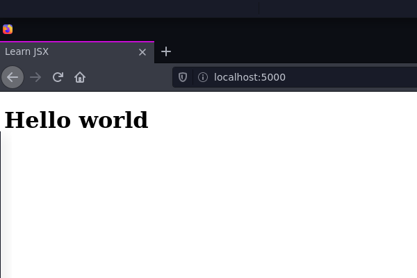
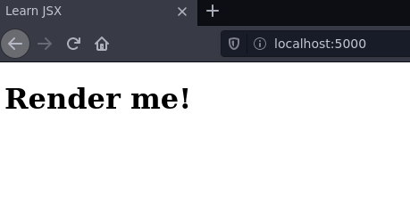

# Rendering JSX
You’ve learned how to write JSX elements! Now it’s time to learn how to render them. To render a JSX expression means to make it appear on the screen.  
> The following code will render a JSX expression:
```jsx
ReactDOM.render(<h1>Hello world</h1>, document.getElementById('app'));
```
JavaScript is case-sensitive, so make sure to capitalize ReactDOM correctly!  
  
Let’s examine the code that you just viewed above.  

You can see something called ReactDOM. What’s that?  

`ReactDOM` is the name of a **JavaScript library**. This library contains several React-specific methods, all of which deal with the DOM in some way or another.  

Move slightly to the right, and you can see one of `ReactDOM`‘s methods: `ReactDOM.render()`.

`ReactDOM.render()` is the most common way to render JSX. It takes a JSX expression, creates a corresponding tree of DOM nodes, and adds that tree to the DOM. That is the way to make a JSX expression appear on the screen.  

Move to the right a little more, and you come to this expression:

```html
<h1>Hello world</h1>
```

This is the first argument being passed to `ReactDOM.render()`. `ReactDOM.render()`‘s first argument should be a JSX expression, and it will be rendered to the screen.

 
> Move to the right a little more, and you will see this expression:
```js
document.getElementById('app')
```


You just learned that ReactDOM.render() makes its first argument appear onscreen. But where on the screen should that first argument appear?  

The first argument is appended to whatever element is selected by the second argument. 

In the code below, see if you can find an element that would be selected by `document.getElementById('app')`.

```html
<!DOCTYPE html>
<html lang="en">
<head>
	<meta charset="utf-8">
	<link rel="stylesheet" href="/styles.css">
	<title>Learn JSX</title>
</head>

<body>
  <main id="app">
    <h1>Render me!</h1>
  </main>
</body>

</html>
``` 



Here, The element with `id = "app"` acted as a container for `ReactDOM.render()`‘s first argument!