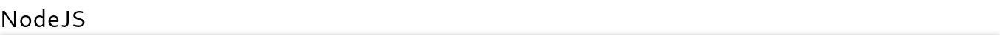
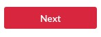
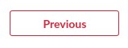
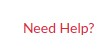
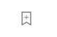
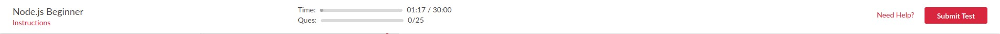

Here in this article, we will be making the below `navbar` in ReactJS.


As shown in the picture you could make an analysis of the very basic components which we could make in order to sum it up and create this whole navbar. So, the component we could see here are:
- Title
  - NodeJS
- Link Button
  - Instruction
  > The red color text is actually a button
- Accent Button
  - Submit Test

So broadly, there are three components that we have to make __Title__, __LinkButton__, and __AccentButton__. Then, we will wrap it up inside another component so-called __Navbar__. Let's start with some starter code setup which you have known earlier in #1.

Since you have __Set-Up-a-React-Project-With-Parcel__. So we could start by making some files and folders for __components__ in our project directories as:
```
quizme
├── index.html                     A normal HTML file for invoking React script
├── package.json
└── src                            // Everything needs to be done inside this directory
    ├── components                 // Directory containing all components
    │   ├── Button                 // All types of Button will be present inside this sub-directory
    │   │   ├── Button.css         // CSS file to be linked in Button.js file
    │   │   └── Button.js          // File where all types of Button components will be designed
    │   ├── Navbar                 // Wrapper component which will call both Title and Button component in it
    │   │   ├── Navbar.css         // CSS file to be linked in Navbar.js file
    │   │   └── Navbar.js          // Navbar component which will compose of Title and Button component
    │   └── Title                  // Title component
    │       ├── Title.css          // CSS file to be linked in Title.js file
    │       └── Title.js           // Title component will be designed in this file
    ├── index.js                   // Initial page for this whole react-setup
    └── Theme.css                  // Theming will be decided in this CSS file
```
#

## Theming

At first, let's define some color variables which will be continuously used in this whole development. As well as set `margin`, `padding` to `0` for each and every element along with `box-sizing` set to `border-box` as:

> **src/Theme.css**

```css
:root{
    --accent: rgb(204, 62, 0);
    --darkAccent: rgb(138, 41, 0);
    --pure: #ffffff;
    --dark: #000000;
    --lightGrey: #D6D6D6;
    --darkGrey: #A7A7A7;
}

*{
    margin: 0;
    padding: 0;
    box-sizing: border-box;
}
```
#

## Components
As you can see we have made a __components__ sub-directory inside the __src__ directory. We will create all our components (basic as well as composite) here in this sub-directory by creating separate sub-directories for each one of them as per need.

Let's get started with the __Title__ component.

#

### Title component
- Import React
- Import CSS file
- Create a class component
- Export class component

> **src/components/Title/Title.js**

```js
import React from "react";
import "./Title.css";

class Title extends React.Component{
    render(){
        return (
            <h1>{this.props.name}</h1>
        )
    }
}

export default Title;
```
Within the render function, we have returned a JSX element with
- A Heading H1
    - Here we will render the "name" which this component will receive in __props__.

Since we required only one __Title__ component, we designed a single component. But if we required a number of __Title__ components then, we could design that many components here, all with different names of variables, and at that time we would not be exporting them as default which we have done here right now. At that time, we would export them like:

- export Title_Component1
- export Title_Component2
- and so on

And at the time, if we want to import these components, we will be importing it like:
- import {Title_Componenet1, Title_Componenet2} from "file_path";

Now it's time to style our __Title__ component in reference to the heading __h1__.

> **src/components/Title/Title.css**

```css
h1{
    font-size: 2.5rem;
    color: var(--dark);
    letter-spacing: 1.2px;
}
```
Hurray! We have completed one component. Now, you can simply call this __Title__ component inside the `src/index.js` file with the following code:
> **src/index.js**

```js
import React from "react";
import ReactDOM from "react-dom";
import "./Theme.css";
import Title from "./components/Title/Title";

class App extends React.Component {
    render() {
        return (
            <Title name="NodeJS" />    // Passing data as props
        )
    }
}
ReactDOM.render(
    <App />,
    document.getElementById("app")
)
```
An interesting fact here is the way we passed the data as props while calling the __Title__ component. This is how you could pass data while calling any component. Make sure that you must provide a valid value to each prop that has been used in the definition of the calling component, otherwise, you will get an error while making calls to those components.

Now, you can type the below command to start the server and visit _`http://localhost:1234/`_ to get output in the browser.

> $ **`npm start`**

**Output:**


#

### Button component

- Import React
- Import CSS file
- Create a class component for Accent Button
  - Export class component as default
- Create another class component for Link Button
  - Export class component

> **src/components/Button/Button.js**

```js
import React from "react";
import "./Button.css";

class AccentButton extends React.Component{
    render(){
        return(
            <button className="accent-button">
                {this.props.content}
            </button>
        )
    }
}

export class LinkButton extends React.Component{
    render() {
        return(
            <button className="link-button">
                {this.props.content}
            </button>
        )
    }
}

export default AccentButton;
```
Within these render functions, we have returned a JSX element with
- Button element
  - Here we will render the "content" which this component will receive in __props__.

Now it's time to style both the components in reference to the className of their __Button__ element.

> **src/components/Button/Button.css**

```css
button{
    width: 9rem;
    font-size: 1.1rem;
    padding: 0.5rem 0;
    margin: 0.5rem 0;
    color: var(--pure);
    background: var(--accent);
    border: 2px solid var(--accent);
    border-radius: 0.2rem;
    cursor: pointer;
    outline: none;
}

.accent-button:active{
    background: var(--darkAccent);
    border-color: var(--darkAccent);
    outline: none;
}

.link-button {
    font-size: 1.2rem;
    color: var(--accent);
    background: transparent;
    padding: 0;
    margin: 0;
    border: none;
    width: fit-content;
    width: -moz-fit-content;
}
```
Hurray! We have completed one more component. Now if you want then you can simply call these __Button__ components inside the `src/index.js` file with the following code:

> **src/index.js**

```js
import React from "react";
import ReactDOM from "react-dom";
import AccentButton from "./components/Button/Button";
import "./Theme.css";

class App extends React.Component {
    render() {
        return (
            <div>
                <LinkButton content="Instructions" />
                <AccentButton content="Submit Test" />
            </div>
        )
    }
}
ReactDOM.render(
    <App />,
    document.getElementById("app")
)
```
Since ***`A JSX expression must have only one parent element`*** and here, there are two of them as `LinkButton` and `AccentButton`. Hence, we have encapsulated both of these elements inside another `div` element.

Now, you can type the below command to start the server and visit _`http://localhost:1234/`_ to get output in the browser.

> $ **`npm start`**

**Output:**


#

### Navbar component

Now, it's time to build a composite component by using __Title__, __LinkButton__, and __AccentButton__ component within one __Navbar__ component.
- Import React
- Import CSS file
- Create a class component
- Export class component

> **src/components/Navbar/Navbar.js**

```js
import React from "react";
import "./Navbar.css";
import Title from "../Title/Title";
import AccentButton, { LinkButton } from "../Button/Button";

class Navbar extends React.Component {
    render() {
        return (
            <nav>
                <div>
                    <Title title={this.props.title} />
                    <LinkButton content="Instructions" />
                </div>
                <AccentButton content="Submit Test" />
            </nav>
        )
    }
}

export default Navbar;
```
Here, we are returning a JSX element as
- `nav` element
  - __Div__ element to wrap __Title__ and __LinkButton__ components together as a single flex-element since `nav` here will act as a flex-container
    - __Title__ component with the name (will assign value to it from the current component props) prop.
    - __LinkButton__ component with the content prop.
  - __AccentButton__ component with the content prop.

Let's apply some styling on this component as:
> **src/components/Navbar/Navbar.css**

```css
nav{
    display: flex;
    flex-direction: row;
    align-items: center;
    justify-content: space-between;
    padding: 0.5rem 1.5rem;
}
```

Now, it's time to call this component from the `index.js` file with the following code:

> **src/index.js**

```js
import React from "react";
import ReactDOM from "react-dom";
import Navbar from "./components/Navbar/Navbar";
import "./Theme.css";

class App extends React.Component {
    render() {
        return (
            <Navbar title="NodeJS" />
        )
    }
}
ReactDOM.render(
    <App />,
    document.getElementById("app")
)
```
Now, you can type the below command to start the server and visit _`http://localhost:1234/`_ to get output in the browser.

> $ **`npm start`**

**Output:**


# Task
Coming to the __`QuizMe`__ project. The above-made components need to be more specified. So here are the details of each component. Make it as per the specification:
## Title component


* Tag - H1
* color - #222
* letter-spacing - 1px
* font-size - set for all screen size
* props - {title :  PropTypes.string}
## Button component
* Tag - button
* props - {label : PropTypes.string}
* type - {Accent Button , Outline Button , Link Button , icon Button}

* Accent Button

* Outline Button


* Link Button


* Icon Button


### Final Navbar


* Components to be used - title, button(link, accent), progress
* __Leave the middle `ProgressBar` component for now__