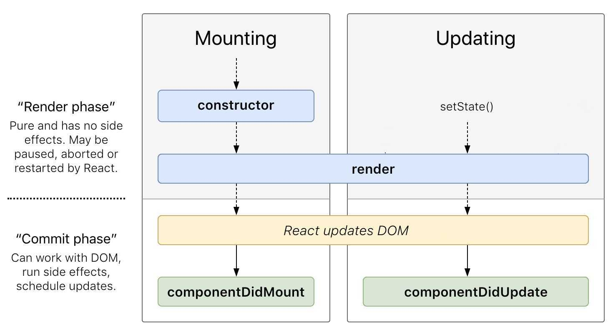

# What is State?
State is used in React Component Classes to make them dynamic. It enables the component to keep track of changing information in between renders. More specifically, the state of a component is an object that holds information that may change over the lifetime of the component.

## What is the difference between state and props?
*`props`* (short for “properties”) and *`state`* are both plain JavaScript objects. While both hold information that influences the output of render, they are different in one important way: *`props`* get passed to the component (similar to function parameters) whereas *`state`* is managed within the component (similar to variables declared within a function).

## Using State
When using State, we need the state of a component to always exist — so we need to set an initial state. We can do so by defining our state in the constructor of our component class, like so:
```js
class App extends React.Component {
  constructor(props){
  // calling the constructor of its parent
  super(props);               // initialization process

  // initializing state of this component in object form
  this.state ={
    time: new Date(),
    startFetchRequest: false,
    quotes: []
  };
}
```
## Updating State
The next thing to know about the state is that it should __never be explicitly updated__. React will use an observable object for the state, which allows the component to behave accordingly.

If for example, we’re to update a components’ state like so:
```js
this.state.startFetchRequest = true;
```
We’d have a render error! As the state wouldn’t be able to detect the changes.

## `setState()`
This is why we use the built-in React method of `setState()`. It takes a single parameter and expects an object containing our set of values to be updated.

The method will update our state and then call the `render()` method to re-render the page. Therefore the proper way to update our state, is like so:
```js
this.setState({startFetchRequest: true});
```
We can also take advantage of React’s asynchronous abilities by setting multiple states, in one `setState()` method. A use case for this might be when we want to keep a count 
> (for example — __tracking likes of a post or photo__).
```js
// Initial state in constructor
this.state={
  count:4,
  total:10
}
```
### Functional approach to `setState()`
#### Signature
```js
setState(updater)
```
This is actually an updater function with the signature:
```js
(prevState, props) => stateChange
```
`prevState` is a reference to the previous state. It should not be directly mutated. Instead, changes should be represented by building a new object based on the input from `prevState` and `props`.
```js
// First argument -> Previous state
// Second argument -> Props at the time the state is applied
this.setState((prevState, props) => ({
  total: prevState.count + props.diff 
}));
```
Here we’re taking our __previous__ component `state` and it's `props`, as a parameter, and then we’re updating the `total`.
# React Component Lifecycle
In general, we might define a lifecycle as birth, growth & death. And our React components follow this cycle as well: they’re created (mounted on the DOM), they experience growth (by updating) and they die (unmounted from the DOM). This is the component lifecycle!

Within the lifecycle of a component, there are different phases. These phases each have their own lifecycle methods. Let's now take a look at these methods.
1.  Initial Phase
1.  Updating Phase
1.  Unmounting Phase

Each of these phases contains some lifecycle methods which are specific only to them. So let’s now find out what happens during each of these phases.

- Initial Phase – The first phase of the lifecycle of a React component is the initial phase or initial rendering phase. In this phase, the component is about to start its journey and make its way to the DOM. This phase consists of the following methods which are invoked in a predefined order.
  - __render():__ This method is responsible for returning a single root HTML node and must be defined in each and every component. You can return null or false in case you don’t want to render anything.
  - __componentDidMount():__ Once the component is rendered and placed on the DOM, this method is called. Here you can perform any DOM querying operations.
```jsx
class Li extends React.Component{
    render(){
        return(
            <li>
                {this.props.children.quote}
            </li>
        )
    }
    // In this component "this.props.children" is used to access data which comes
    // under the component call. It will become more clear with the below component example. 
}
class App extends React.Component {
  ...
  componentDidMount() {
      console.log('Component did mount!')
      console.log('Now you can get start with your further service initialization or api calls')
  }
  render() {
      return (
         <div>
           <h1>Hello mounting methods!</h1>
           <h2>It's {this.state.time.toLocaleTimeString()} right now</h2>
           <p>We have a collection of <span>{this.state.quotes.length}</span> quotes inspired from <span>Taylor swift</span></p>
           <button onClick={()=>{
             this.setState((prevState) => (
               {startFetchRequest: !prevState.startFetchRequest}
             ))
           }}>
               {this.state.startFetchRequest?"Stop":"Start"}  getting quotes
           </button>
           <div>
             <ol>
               {this.state.quotes.map((quoteObject, index)=>
                 <Li key={index+quoteObject.quote}>
                   {quoteObject}
                 </Li>
               )}
             </ol>
           </div>
         </div>
      );
   }
}
```
In the above `App` component, we have used a mouse click event `onClick` in __Button__ just to toggle between _true_ and _false_ value for __`startFetchRequest` state__. You can find a __list of supported events in `ReactJS`__ [__`here`__](https://reactjs.org/docs/events.html#supported-events). Hope you will be having great fun with it in the coming future.

`Note:` Do not forget that in the above code snippet, the piece of code written inside __return()__ statement is actually a __`JSX element`__ in which one can do things related to javascript just by enclosing it inside `{}` like:
 > `<h2>It's {this.state.time.toLocaleTimeString()} right now</h2>`.
- Updating Phase – Once the component is added to the DOM, they can update and re-render only when a state change occurs. Each time the state changes, the component calls its render() again. Any component, that relies on the output of this component will also call its render() again. This is done, to ensure that our component is displaying the latest version of itself. Thus, to successfully update the components state the following methods are invoked in the given order:
  - __shouldComponentUpdate():__ Using this method, you can control your component’s behavior of updating itself. If you return a true from this method, the component will update. Else if this method returns a false, the component will skip the updating. By default, it's returning true.
  - __render():__ If you are returning false via __shouldComponentUpdate()__, the code inside __render()__ will be invoked again to ensure that your component displays itself properly.
  - __componentDidUpdate():__  Once the component is updated and rendered, then this method is invoked. You can put any code inside this method, which you want to execute once the component is updated.
```js
class App extends React.Component {
  ...
  getQuotes() {
    /* method to make an api call for job data */
    const URL = `https://api.taylor.rest`;
    fetch(URL)
      .then(response => response.json())
      .then(data => this.setState((prevState) => {
        const prevQuotes = prevState.quotes.concat(data);
        return{
          time: new Date(),
          quotes:prevQuotes
        }
      }));
  }
  componentDidUpdate(prevProps, prevState) {
    console.log('Component did update!');
    // Since state member has been updated, we will try to look up
    // if the button has been clicked to turn on the getQuote service
    // as well as we also will take care that on each state updation
    // the current state of startFetchRequest should be changed from the previous one
    // otherwise on each state updation you will unnecessarily create
    // a new instance of timer even if only quote has been updated which will leads
    // to hang your whole browser or may be your system could get affected badly
    if(prevState.startFetchRequest!==this.state.startFetchRequest
      && this.state.startFetchRequest){
      console.log("Starting fetch service...")
      this.timer = setInterval(() => {
        this.getQuotes();
        console.log(this.state.quotes);
      }, 1000)
    }
    else if(!this.state.startFetchRequest){
      console.log("Stopping fetch service...")
      clearInterval(this.timer);
    }
  }
  ...
}
```
In the above __`App`__ component, the __`quoteObject`__ which is written inside __`Li`__ component call will be actually accessed through _`this.props.children`_ inside the `Li` component definition.

- The Unmounting Phase – This is the last phase of the components life cycle in which the component is destroyed and removed from the DOM completely. It contains only one method:
  - __componentWillUnmount():__ Once this method is invoked, your component is removed from the DOM permanently. In this method, you can perform any clean-up related tasks like removing event listeners, stopping timers, etc.
```js
class App extends React.Component {
  ...
  componentWillUnmount() {
    clearInterval(this.timer);
  }
  ...
}
```
## one view
Let's understand the process with an explanatory image:



# Final code snippet
> So, finally the complete code will be like:
```jsx
class Li extends React.Component{
    render(){
        return(
            <li>
                {this.props.children.quote}
            </li>
        )
    }
}
class App extends React.Component {
  constructor(props){
  super(props);
  this.state ={
    time: new Date(),
    startFetchRequest: false,
    quotes: []
  };
  componentDidMount() {
      console.log('Component did mount!')
      console.log('Now you can get start with your further service initialization or api calls')
  }
  getQuotes() {
    /* method to make an api call for job data */
    const URL = `https://api.taylor.rest`;
    fetch(URL)
      .then(response => response.json())
      .then(data => this.setState((prevState) => {
        const prevQuotes = prevState.quotes.concat(data);
        return{
          time: new Date(),
          quotes:prevQuotes
        }
      }));
  }
  componentDidUpdate(prevProps, prevState) {
    console.log('Component did update!');
    if(prevState.startFetchRequest!==this.state.startFetchRequest
      && this.state.startFetchRequest){
      console.log("Starting fetch service...")
      this.timer = setInterval(() => {
        this.getQuotes();
        console.log(this.state.quotes);
      }, 1000)
    }
    else if(!this.state.startFetchRequest){
      console.log("Stopping fetch service...")
      clearInterval(this.timer);
    }
  }
  componentWillUnmount() {
    clearInterval(this.timer);
  }
  render() {
      return (
         <div>
           <h1>Hello mounting methods!</h1>
           <h2>It is {this.state.time.toLocaleTimeString()} right now</h2>
           <p>We have a collection of <span>{this.state.quotes.length}</span> quotes inspired from <span>Taylor swift</span></p>
           <button onClick={()=>{
             this.setState((prevState) => (
               {startFetchRequest: !prevState.startFetchRequest}
             ))
           }}>
               {this.state.startFetchRequest?"Stop":"Start"}  getting quotes
           </button>
           <div>
             <ol>
               {this.state.quotes.map((quoteObject, index)=>
                 <Li key={index+quoteObject.quote}>
                   {quoteObject}
                 </Li>
               )}
             </ol>
           </div>
         </div>
      );
   }
}
```
`Caution:` While doing experiments, increase the time interval to 5 sec or more so that your application couldn't get hangup.

- Supporting CSS file to make it more worthy
```css
*{
    margin: 0;
    padding: 0;
    box-sizing: border-box;
}
body{
    background: #00F260;  /* fallback for old browsers */
    background: -webkit-linear-gradient(to right, #0575E6, #00F260);  /* Chrome 10-25, Safari 5.1-6 */
    background: linear-gradient(to right, #0575E6, #00F260); /* W3C, IE 10+/ Edge, Firefox 16+, Chrome 26+, Opera 12+, Safari 7+ */
    background-repeat: no-repeat;
}
button{
    font-size: 1.1rem;
    padding: 0.5rem 1rem;
    margin: 1rem 0;
    color: #6E1E1E;
    background-image: linear-gradient(90deg, #FA8BFF 0%, #2BD2FF 52%, #0D6D37 90%);
    background-size: 400%;
    background-position: left;
    border: none;
    border-radius: 0.5rem;
    cursor: pointer;
    outline: none;
    transition: all 0.5s ease;
}
button:hover{
    color: #FA8BFF;
    background-position: right;
}
span{
    font-size: 1.2rem;
    color:rgb(116, 39, 39);
    font-weight: 600;
    cursor: pointer;
    transition: all linear 0.5s;
}
span:hover{
    color:rgb(1, 14, 121);
}
div{
    margin: 2rem;
}
ol {
    list-style-type: decimal-leading-zero;
}
li{
    border: 1.5px solid #342ac2;
    padding: 1rem;
    margin: 0.5rem;
    border-radius: 0.5rem;
    background-color: #FA8BFF;
    background-image: linear-gradient(45deg, #FA8BFF 0%, #2BD2FF 52%, #2BFF88 90%);
}
```