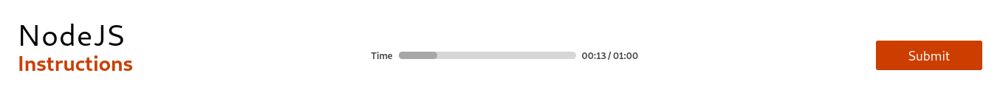
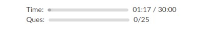
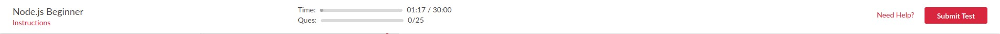

In this article, we will be adding a __Progress__ component in center of the previously designed __Navbar__ component as:


This progress bar consists of:
- Label (In both sides of the bar)
- Bar (Dark Grey area in progress bar showing actual completion)
- ProgressBar (Light Grey area below Bar as a background)

To make this component we will create another sub-directories in `src/components` sub-directories as:
```
src/components/Progress             sub-directory for Progress component
├── Progress.css                    CSS file to be used for components inside Progress.js file
├── Progress.js                     Progress component to be designed
├── ProgressWrapper.css             CSS file for ProgressWrapper
└── ProgressWrapper.js              Wrapper component (flexbox) for Progress component
```
Let's get started with our first component
### Progress
As you can see in the above image, _Progress_ consists of two labels and a progress bar:
- Left side label -> `"Time"`
- Right side label -> `00:13/01:00`
- Progress bar
  - This we can design by keeping a dark-colored division element right above another light-colored division element with the help of position styling.
  - We just have to take care of the width property of the upper dark-colored division element as it needs to grow dynamically.

Both these labels are having a margin of `0.5rem` from the middle bar. So we will create a label component first.
#### Label
* Import React
* Import CSS file
* Create a functional component

> **src/components/Progress/Progress.js**
```js
import React from "react";
import "./Progress.css";

function Label(props) {
    return (
        <label className={"progress-label "+props.margin}>
            {props.children}
        </label>
    )
}
```
Here we are returning a JSX element with:
- Label element having a static class name __"progress-label"__, as well as a dynamic class. Since we want to use this label on both sides of the __bar__ hence, will add class on both the labels accordingly as if we want to put a label on _left_ side of the bar then, will pass __margin__ value as __"margin-left"__ (It will apply CSS for margin-left) or if want to put a label on __right__ side of the bar then, will pass __margin__ value as __"margin-right"__ (It will apply CSS for margin-right).
  - **Rendering children** : If we have called a component by declaring something inside that component and want to access it in the calling component's definition then we can access it with __`props.children`__ (will get to know more about it while using in below demonstration).

Now it's time to style our __Label__ with reference to the static and dynamic class names as:
> **src/componenets/Progress/Progress.css**
```css
.progress-label {
    font-size: 0.8rem;
    font-weight: 600;
}
.margin-left {
    margin-left: 0.5rem;
}
.margin-right {
    margin-right: 0.5rem;
}
```
Likewise, we will proceed to our next functional component __Bar__
#### Bar
- Create a functional component
> **src/components/Progress.js**
```js
function Bar(props) {
    const progressFactor = props.current / props.total;
    const widthStyle = {
        width: progressFactor >= 1 ? "100%" : progressFactor * 100 + "%"
    }
    return (
        <div className="progress-bar">
            <div className="progress" style={widthStyle} />
        </div>
    )
}
```
- Here we are calculating __progressFactor__ of how much amount has been done out of the total amount.
- An interesting fact here is that you will learn __how to dynamically apply inline-CSS in React__.
  - You have to create a style object with all comma-separated `key: value` pairs.
  - Here in this component it's __widthStyle__, where we are calculating width with help of the __progressFactor__
  - And you can apply it directly to your JSX element by passing it within a curly brace as the value of __style__ property.
- It's returning a JSX element as:
  - `div` element with class name "progress-bar". This `div` is actually ProgressBar (Light Grey area means under Bar the background)
    - `div` element with class name "progress" and a dynamic inline-CSS. This `div` is actually the Bar (Dark Grey area in progress bar showing actual completion) which will be positioned `absolutely` over its parent `div` "progress-bar".

Now it's time to style our __Bar__ with reference to the static and dynamic class names as:
> **src/componenets/Progress/Progress.css**
```css
.progress-bar {
    position: relative;
    background: var(--lightGrey);
    height: 0.6rem;
    width: 15rem;
    border-radius: 0.5rem;
}
.progress-bar > .progress {
    position: absolute;
    height: inherit;
    border-radius: inherit;
    background: var(--darkGrey);   
}
```
Likewise, we will proceed to our next final functional component of  __Progress__
#### Progress
- Create an arrow function.
- Create a functional component.
- Export it as a default component.
> **src/components/Progress.js**
```js
export const stringToSec = (time) => parseInt(time.substring(0, 2)) * 60 + parseInt(time.substring(3));


export default function Progress(props) {
    const { label, currentValue, maxValue } = props;
    return (
        <div className="flex-container">
            <Label margin="margin-right">
                {label}
            </Label>
            <Bar current={stringToSec(currentValue)} total={stringToSec(maxValue)} />
            <Label margin="margin-left">
                {currentValue} / {maxValue}
            </Label>
        </div>
    )
}
```
- Here we have defined an arrow function which will convert a string of time format like "10:20" to its seconds' value like `80`.
- We are returning a JSX element as:
  - `div` element with class name "flex-container".
    - Above defined `Label` component with margin value "margin-right" since this label has to be on the left side of the __Bar__.
      - Inside this component, we have rendered the `label` variable within curly brace as extracted through `props`. This is the data that we could access in the definition of __Label__ component by `props.children`.
    - Above defined `Bar` component with __current__ and __total__ data.
    - Above defined `Label` component with margin value "margin-left" since this label has to be on the right side of the __Bar__. And we have mentioned the data which we need to render inside this component.

Now it's time to style our __Progress__ with reference to the class names as:
> **src/componenets/Progress/Progress.css**
```css
.flex-container {
    display: flex;
    align-items: center;
    justify-content: flex-start;
}
```
Hurray! We have completed one component. Now it's time to design its wrapper component and that's all for this article.
### ProgressWrapper
- Import __React__, __useState__, __useEffect__
- Import CSS file
- Import Progress as __ProgressBar__ and __stringToSec__ from "Progress.js" file
```js
import React, { useState, useEffect } from "react";
import "./ProgressWrapper.css";
import ProgressBar, { stringToSec } from "./Progress";

const getTimeString = (min, sec) => (min < 10 ? "0" + min : min) + ":" + (sec < 10 ? "0" + sec : sec)


export default function ProgressWrapper(props) {
    const maxTime = stringToSec(props.maxTime);
    const [time, setTime] = useState({minute:0, second:0});
    useEffect(() => {
        let timer = setInterval (()=> {
            setTime(time => {
                if(time.minute*60+time.second < maxTime){
                    if(time.second + 1 ===60){
                        return{
                            minute: time.minute+1,
                            second: 0
                        }
                    }else{
                        return{
                            ...time,
                            second: time.second + 1
                        }
                    }
                }else return time;
            })
        }, 1000)
        return ()=> {
            clearInterval(timer);
        }
    }, [])
    const currentTimeString = getTimeString(time.minute, time.second);
    return(
        <div className="progress-wrapper">
            <ProgressBar label="Time" currentValue={currentTimeString} maxValue={props.maxTime}/>
        </div>
    )
}
```
Here the first function `getTimeString` which we have defined can convert minutes and seconds into a well-formed string.

In the ProgressWrapper component,
- Convert maxTime taken from props to a well-formed string.
- Create a state and it's dispatch function namely __time__ and __setTime__ with a initial state value _`{minute:0, second:0}`_ using `useState` react hook.
- Use `useEffect` react hook to define time interval of 1 second in order to set next __time__ state using its Dispatch function __setTime__.
  - Mention that we have used a spread operator(`...`) in our logic which _`React doesn't support`_. ___`In order to make our React application supporting spread operator, we have to install a plugin called "babel-plugin-transform-object-rest-spread"`___ through __npm__ using the following command
    - > **`npm i babel-plugin-transform-object-rest-spread`**
  - Once it gets installed, we have to mention it as __plugins__ in our __.babelrc__ file. So our final code in __.babelrc__ file will become:
  - ```js
    {
        "presets": ["env", "react"],
        "plugins": ["transform-object-rest-spread"]
    }
    ```
  - Now from `useEffect` react hook return a function which is clearing the __timer__ interval. So that it will destroy the __timer__ before unmounting the __ProgressWrapper__ component.
  - Pass an empty array as it's __Dependency List__ means this hook will only be called once this component gets mounted.
- Store well-formed time string in __currentTimeString__ variable.
- Return a JSX element as:
  - `div` element with class name "progress-wrapper".
    - Above imported `ProgressBar` with a __label__, __currentValue__ and __maxValue__ value as its props.

Now it's time to style our __ProgressWrapper__ with reference to the class name as:
> **src/componenets/Progress/ProgressWrapper.css**
```css
.progress-wrapper {
    padding: 0;
    display: flex;
    justify-content: flex-start;
    flex-direction: column;
}
```
And here is the time to see our final view by introducing this component in our __Navbar__ component as:
> **src/components/Navbar/Navbar.js**
```js
import React from "react";
import "./Navbar.css";
import Title from "../Title/Title";
import Button from "../Button/Button";
import ProgressWrapper from "../Progress/ProgressWrapper";

class Navbar extends React.Component{
    render(){
        return(
            <nav>
                <Title name={this.props.title} content={"Instructions"}/>
                <ProgressWrapper  maxTime="01:00" />
                <Button content={"Submit"} />
            </nav>
        )
    }
}

export default Navbar;
```
We have given maximum time of __1 minutes 0 second__ to the __ProgressWrapper__ component. let's see the output in the browser by running the command:
> $ **`npm start`**

Output:


# Task
Coming to the task part you have to make a similar progress bar for _Question completion_ as:
## Progress Bar component


*  Tag - progress
*  background-color - #DBDBDB;
*  color - #A7A7A7
*  props - { label : PropTypes.string , currentValue : PropTypes.number , maxValue : PropTypes.number } 
*  label - { time :date , number : number }

The time progress bar is done. Now, you have to create the other one regarding question completion.

### Final Navbar
