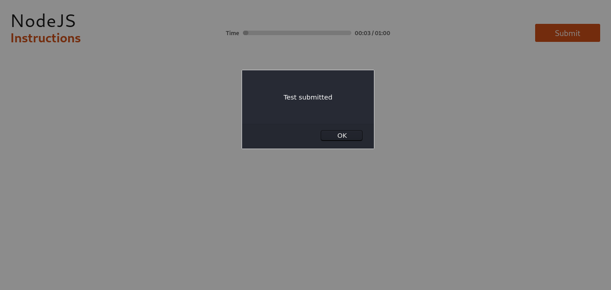

Just like HTML, React can perform actions based on user events.

React has the same events as HTML: click, change, mouseover, etc.
## Adding Events
- React events are written in camelCase syntax:
  - `onClick` instead of `onclick`.
- React event handlers are written inside curly braces:
  - `onClick={shoot}`  instead of `onClick="shoot()"`.

For example, the HTML:
```html
<button onclick="activateLasers()">
  Activate Lasers
</button>
```
is slightly different in React:
```js
<button onClick={activateLasers}>
  Activate Lasers
</button>
```
## Event Handlers
A good practice is to put the event handler as a method in the component class:
> Put the shoot function inside the Football component:
```js
class Football extends React.Component {
  shoot() {
    alert("Great Shot!");
  }
  render() {
    return (
      <button onClick={this.shoot}>Take the shot!</button>
    );
  }
}
```
### Bind `this`
For methods in React, the `this` keyword should represent the component that owns the method.

That is why, you should always use arrow functions with `this`. With arrow functions, `this` will always represent the object that defined the arrow function.
```js
class Football extends React.Component {
  constructor(props){
    super(props);
    this.shoot = () => {
      alert(this);
      /*
      The 'this' keyword refers to the component object
      */
    }
  }
  render() {
    return (
      <button onClick={this.shoot}>Take the shot!</button>
    );
  }
}
```
`Note` that while running __React__ with __Parcel__, _`arrow functions should not be written as class methods`_. Instead of this, you can initialize it in the constructor itself.

If you _must_ use regular functions instead of arrow functions you have to bind `this` to the component instance using the `bind()` method:
> Make this available in the shoot function by binding it in the constructor function:
```js
class Football extends React.Component {
  constructor(props) {
    super(props)
    this.shoot = this.shoot.bind(this)
  }
  shoot() {
    alert(this);
    /*
    Thanks to the binding in the constructor function,
    the 'this' keyword now refers to the component object
    */
  }
  render() {
    return (
      <button onClick={this.shoot}>Take the shot!</button>
    );
  }
}
```
> Without the binding, the `this` keyword would return undefined.
### Passing Arguments
If you want to send parameters into an event handler, you have two options:

__1. Make an anonymous arrow function:__
> Send "Goal" as a parameter to the shoot function, using arrow function:
```js
class Football extends React.Component {
  constructor(props) {
    super(props);
    this.shoot = (a) => {
      alert(a);
    }
  }
  render() {
    return (
      <button onClick={() => this.shoot("Goal")}>Take the shot!</button>
    );
  }
}
```
or

__2. Bind the event handler to `this`.__

Note that the first argument has to be `this`.
> Send "Goal" as a parameter to the `shoot` function:
```js
class Football extends React.Component {
  shoot(a) {
    alert(a);
  }
  render() {
    return (
      <button onClick={this.shoot.bind(this, "Goal")}>Take the shot!</button>
    );
  }
}
```
> __Note on the second example:__ If you send arguments without using the bind method, `(this.shoot(this, "Goal")` instead of `this.shoot.bind(this, "Goal"))`, the shoot function will be executed when the page is loaded instead of waiting for the button to be clicked.
### React Event Object
Event handlers have access to the React event that triggered the function.

In our example, the event is the "click" event. Notice that once again the syntax is different when using arrow functions or not.

With the arrow function you have to send the event argument manually:
> Arrow Function: Sending the event object manually:
```js
class Football extends React.Component {
  constructor(props){
    super(props);
    this.shoot = (a, b) => {
      alert(b.type);
      /*
      'b' represents the React event that triggered the function,
      in this case the 'click' event
      */
    }
  }
  render() {
    return (
      <button onClick={(ev) => this.shoot("Goal", ev)}>Take the shot!</button>
    );
  }
}
```
Without arrow function, the React event object is sent automatically as the last argument when using the bind() method:
> With the `bind()` method, the event object is sent as the last argument:
```js
class Football extends React.Component {
  constructor(props){
    super(props);
    this.shoot = (a, b) => {
      alert(b.type);
      /*
      'b' represents the React event that triggered the function,
      in this case the 'click' event
      */
    }
  }
  render() {
    return (
      <button onClick={this.shoot.bind(this, "Goal")}>Take the shot!</button>
    );
  }
}
```
## Handling Events in Functional Component
In the case of functional component, there is nothing to do with `this`, and hence your work done becomes easy as by just defining your event handling function normally with a synthetic event parameter.
```js
function ActionLink() {
  function handleClick(e) {
    e.preventDefault();
    console.log('The link was', e.type);
  }
  return (
    <a href="#" onClick={handleClick}>
      Click me
    </a>
  );
}
```
## Implementation
Now you have to implement a button click event on the _`Submit Test`_ button. Once clicked it should give an alert message "Test submitted" like:
