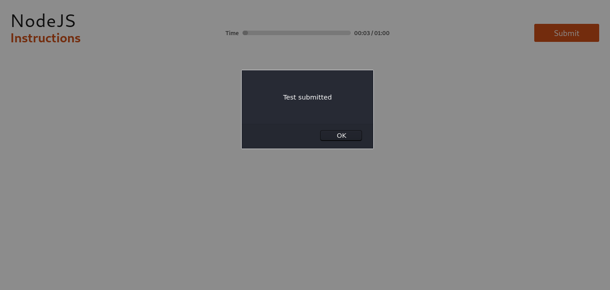

In this article, you will be implementing `event handling` on the __Submit__ button as:


It has a very quick and simple implementation. So, let's start with our Button component file:
> **src/components/Button/Button.js**
```js
class Button extends React.Component{
    constructor(props){
        super(props);
        this.handleClick = () => {
            alert("Test submitted");
        }
    }
    render(){
        return(
            <button onClick={this.handleClick}>
                {this.props.content}
            </button>
        )
    }
}
```
Already mentioned in the previous article, that if you want to use an arrow function then, you have to initialize it in the constructor only.

We have provided the rendering __`Button`__ element with an __`onClick`__ event that will handle this event with __handleClick()__ method initialized in the constructor.

Once get done with this, you can run this command to start your server and check it on your browser screen:
> $ **`npm start`**