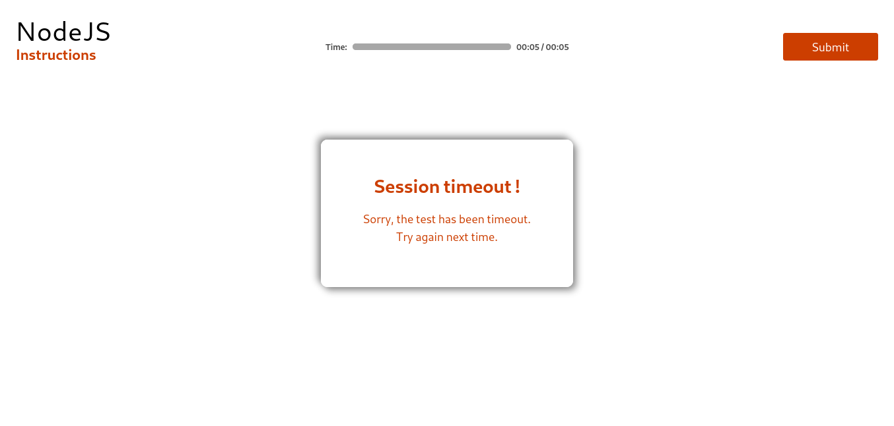

Conditional rendering as a term describes the ability to render different UI markup based on certain conditions. In React-speak, it is a way to render different elements or components based on a condition. This concept is applied often in the following scenarios:
-  Rendering external data from an API
-  Showing/hiding elements
-  Toggling application functionality
-  Implementing permission levels
-  Authentication and Authorization

As a challenge, based on the value of `isLoggedIn` in our component state, we want to be able to display a `Login` button if the user isn’t logged in, and a `Logout` button if he/she is. In this article, we examine __six(6)__ ways to implement such conditional rendering in React applications. Let's start with a normal component:
> Component containing a `isLoggedIn` state and rendering a division of heading along with two buttons.
```js
class App extends Component {
  constructor(props) {
    super(props);
    this.state = {
      isLoggedIn: true
    };
  }
  render() {
    return (
      <div>
        <h1>
          This is a Demo showing several ways to implement Conditional Rendering
          in React.
        </h1>
        <button>Login</button>
        <button>Logout</button>
      </div>
    );
  }
}
```
# 1. using an if...else statement
In JSX, we are able to mix up JavaScript code with our markup to ensure stunning interactivity within our application. To do this we use a set of curly braces `{}` and write our JavaScript within. The restriction however is that there is a limit to what can be done within such braces. As a result, the code snippet below for the `render()` function would fail to achieve the desired result.
```js
...
render() {
    let {isLoggedIn} = this.state;
    return (
      <div className="App">
        <h1>
          This is a Demo showing several ways to implement Conditional Rendering
          in React.
        </h1>
        {
          if(isLoggedIn){
            return <button>Logout</button>
          } else{
            return <button>Login</button>
          }
        }
      </div>
    );
}
...
```
Since inside `{}` there is no function written so to whom or where did the JSX element written in __return__ statement will be returned? And hence, this code would not work as expected.

To solve this, we extract the conditional logic into a function inside the `render()` function as shown below:
```js
...
render() {
    let {isLoggedIn} = this.state;
    const renderAuthButton = ()=>{
      if(isLoggedIn){
        return <button>Logout</button>
      } else{
        return <button>Login</button>
      }
    }
    return (
      <div className="App">
        <h1>
          This is a Demo showing several ways to implement Conditional Rendering
          in React.
        </h1>
        {renderAuthButton()}
      </div>
    );
}
...
```
Notice that we extract the logic from JSX into a function `renderAuthButton`. Thus, we only need to execute the function within the JSX curly braces.
### Multiple return statements
In using this method, the component must be kept as simple as possible to avoid a wasted re-render of sibling or parent components. As a result of this, we create a new functional component called `AuthButton`.
```js
// AuthButton.js

import React from "react";

const AuthButton = props => {
  let { isLoggedIn } = props;
  if (isLoggedIn) {
    return <button>Logout</button>;
  } else {
    return <button>Login</button>;
  }
};
export default AuthButton;
```
`AuthButton` returns various elements/components depending on the value of state that is passed down via the `isLoggedIn` props. Thus we import it in our `index.js` and pass down the appropriate state as shown below: 
```js
// index.js
...
import AuthButton from "./AuthButton";

...
  render() {
    let { isLoggedIn } = this.state;
    return (
      <div className="App">
      ...
        <AuthButton isLoggedIn={isLoggedIn} />
      </div>
    );
  }
...
```
You must avoid doing this:
```js
// index.js
...
render() {
    let { isLoggedIn } = this.state;
    if (isLoggedIn) {
      return (
        <div className="App">
          <h1>
            This is a Demo showing several ways to implement Conditional
            Rendering in React.
          </h1>
          <button>Logout</button>;
        </div>
      );
    } else {
      return (
        <div className="App">
          <h1>
            This is a Demo showing several ways to implement Conditional
            Rendering in React.
          </h1>
          <button>Login</button>
        </div>
      );
    }
  }
}
...
```
The snippet above would achieve the same result but bloat the component unnecessarily while introducing performance issues as a result of constantly re-rendering an unchanging component.
# 2. Using Element Variables
Element variables are simply variables that hold JSX elements. Thus we can conditionally assign elements/ components to these variables outside our JSX and only render the variable within JSX. See demo below:
```js
// index.js
...
render() {
    let { isLoggedIn } = this.state;
    let AuthButton;
    if (isLoggedIn) {
      AuthButton = <button>Logout</button>;
    } else {
      AuthButton = <button>Login</button>;
    }
    return (
      <div className="App">
        <h1>
          This is a Demo showing several ways to implement Conditional Rendering
          in React.
        </h1>
        {AuthButton}
      </div>
    );
  }
...
```
Notice how we conditionally assign values(components) to `AuthButton` and then we only have to render it neatly within our JSX.
# 3. Using a Switch Statement
As shown previously, we can conditionally return different markups from a component-based on set conditions using an __if…else__ statement. The same could be achieved with a switch statement where we can specify the markup for various conditions. See the example below:
```js
// AuthButton.js
import React from "react";

const AuthButton = props => {
  let { isLoggedIn } = props;
  switch (isLoggedIn) {
    case true:
      return <button>Logout</button>;
      break;
    case false:
      return <button>Login</button>;
      break;
    default:
      return null;
  }
};
export default AuthButton;
```
You may also do away with the `break` statement as the `return` statement automatically terminates the execution.
> __Note:__ Note: Returning `null` from a component will cause it to hide itself/display nothing. This a good way to toggle the visibility of components.
# 4. Ternary Operators
If you are familiar with ternary operators, then you are aware that it is simply a more concise way to write an if statement. Thus, we have:
```jsx
// index.js
...
render() {
    let { isLoggedIn } = this.state;
    return (
      <div className="App">
        <h1>
          This is a Demo showing several ways to implement Conditional Rendering
          in React.
        </h1>
        {isLoggedIn ? <button>Logout</button> : <button>Login</button>}
      </div>
    );
  }
...
```
In cases where, this approach makes the component bloated, bulky, or less readable, you may encapsulate the conditional within a functional component as shown below:
```js
// AuthButton.js
import React from "react";

const AuthButton = props => {
  let { isLoggedIn } = props;
  return isLoggedIn ? <button>Logout</button> : <button>Login</button>;
};

export default AuthButton;
```
# 5. Logical && (Short Circuit Evaluation with &&)
Short circuit evaluation is a technique used to ensure that there are no side effects during the evaluation of operands in an expression. The logical `&&` helps us specify that an action should be taken only on one condition, otherwise, it would be ignored entirely. This is useful for situations where you only need to take an action when a certain condition is true, otherwise do nothing.

For instance, if we only needed to show the `Logout` button if the person is logged in, otherwise we do nothing. We’d have something like this:
```js
// index.js
...
render() {
    let { isLoggedIn } = this.state;
    return (
      <div className="App">
        <h1>
          This is a Demo showing several ways to implement Conditional Rendering
          in React.
        </h1>
        {isLoggedIn && <button>Logout</button>}
      </div>
    );
  }
...
```
This would display the logout button if `isLoggedIn` is `true` otherwise it’d display nothing. We could adapt this to fit our use case as shown below. However, it is not advisable.
```js
// index.js
...
return (
      <div className="App">
        <h1>
          This is a Demo showing several ways to implement Conditional Rendering
          in React.
        </h1>
        {isLoggedIn && <button>Logout</button>}
        {!isLoggedIn && <button>Login</button>}
      </div>
    );
  }
...
```
However, this isn’t recommended as there are better, cleaner ways to achieve the same effect. Also, this could easily make your code look messy and unintuitive once the component gets slightly larger.
# 6. Using Immediately Invoked Function Expressions(IIFEs)
[Earlier](#1-using-an-ifelse-statement) we covered that JSX limitations make it unable to execute every type of JavaScript code. This isn’t entirely true as there are ways to bypass such behavior. One such way is by using IIFEs.

An __IIFE__ ( __I__ mmediately __I__ nvoked __F__ unction __E__ xpression) is a JavaScript function that runs as soon as it is defined. It’s used in the format below.
```js
(function () {
    statements
})();
```
With this technique, we are able to write conditional logic directly within JSX but wrapped within an anonymous function that is immediately invoked on the evaluation of that portion of our code. See the example below:
```js
//index.js
...
render() {
    let { isLoggedIn } = this.state;
    return (
      <div className="App">
        <h1>
          This is a Demo showing several ways to implement Conditional Rendering
          in React.
        </h1>
        {(function() {
          if (isLoggedIn) {
            return <button>Logout</button>;
          } else {
            return <button>Login</button>;
          }
        })()}
      </div>
    );
  }
...
```
The above IIFE can also be written in a slightly more concise manner using an arrow function as shown below:
```js
{(function() {
  if (isLoggedIn) {
    return <button>Logout</button>;
  } else {
    return <button>Login</button>;
  }
})()}
```
### Performance Concerns
As a general rule, it is best to ensure that in implementing conditional rendering you:
-  Do not change the position of components arbitrarily in order to prevent components from unmounting and remounting unnecessarily.
-  Change only the markup that is concerned with the conditional rendering and leave out every other unchanging bit of the component.
-  Do not bloat your component unnecessarily within the render method, thus causing components to delay in rendering.

# Implementation of `conditional rendering`
Now you have to make a `Timeout` component as it will shown up in the center of the web page if there is a timeout during test.
