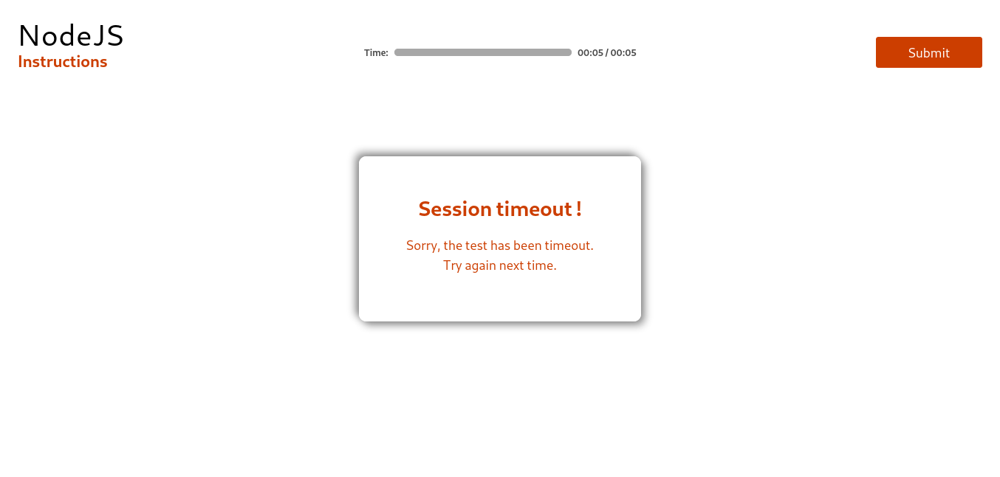

In this article, we will be developing a `Timeout` component that will show a popup dialog once there has been a timeout in the test as:

Let's have a `Timeout` component sub-directory in the `components` directory as:
```
src/components/Timeout/
├── Timeout.css
└── Timeout.js
```
Let's create the __`Timeout`__ component first, then we will see how to implement it.
## Timeout
Get started with its component file
- Import React
- Import CSS file
- Create a functional component
  - Export this component as default
> **src/components/Timeout/Timeout.js**
```js
import React from "react";
import "./Timeout.css";

export default function Timeout() {
    return (
        <div className="timeout">
            <h3>
                Session timeout !
            </h3>
            <p>
                Sorry, the test has been timeout.
            </p>
            <span>
                Try again next time.
            </span>
        </div>
    )
}
```
Here we are returning a JSX element consisting:
- `div` element with class name "timeout"
  - `heading H3`
  - `paragraph P`
  - span element

Now its time to style our `Timeout` component as:
> **src/components/Timeout/Timeout.css**
```css
.timeout{
    display: flex;
    flex-direction: column;
    align-items: center;
    padding: 4rem;
    padding-top: 3rem;
    text-align: center;
    position: fixed;
    left: 50%;
    top: 50%;
    transform: translate(-50%, -50%);
    background: var(--pure);
    color: var(--darkGrey);
    box-shadow: 5px 5px 10px rgba(0, 0, 0, 0.24), -5px -5px 10px rgba(0, 0, 0, 0.24);
    border-radius: 10px;
    cursor: pointer;
    transition: all 0.2s linear;
}
.timeout:hover{
    box-shadow: 5px 5px 10px rgba(0, 0, 0, 0.432), -5px -5px 10px rgba(0, 0, 0, 0.432);
    color: var(--accent);
}
.timeout h3{
    font-size: 1.8rem;
    font-weight: 600;
    margin-bottom: 1rem;
}
.timeout p,span {
    font-size: 1.1rem;
    font-weight: 500;
}
```
- Now it's time to implement it in our `ProgressWrapper` component. __`Question` should arise that why would we implement__ ___Tiemout___ __component here inside our__ ___ProgressWrapper___ __component?__
  - Since it's the ___ProgressWrapper___ component only that has the management of `time` state in itself so to render the `Timeout` component exactly at the right moment, we could get help from this real-time `time` state. And this whole thing will be done with the help of _`Conditional-rendering`_. Let's see how:
# Implementation
- Import __`Timeout`__ component
- Define a function `isTimeout` inside the component
  - If there comes the situation of timeout according to the `time` state of the component then, the function should return a __`Timeout`__ component.
- Use this function for conditional-rendering inside the JSX element which is being returned from __`ProgressWrapper`__ component.

> **src/components/Progress/ProgressWrapper.js**
```js
import Timeout from "../Timeout/Timeout";
...
export default function ProgressWrapper(props) {
    ...
    function isTimeout() {
        if (time.minute * 60 + time.second === maxTime) {
            return <Timeout />
        }
    }

    const currentTimeString = getTimeString(time.minute, time.second);
    return (
        <div className="progress-wrapper">
            <ProgressBar label="Time" currentValue={currentTimeString} maxValue={props.maxTime} />
            {isTimeout()}
        </div>
    )
}
```
Codes have been explained in the above point-wise steps. Hurray, you have implemented a __`Timeout`__ component using `conditional-rendering` as:
