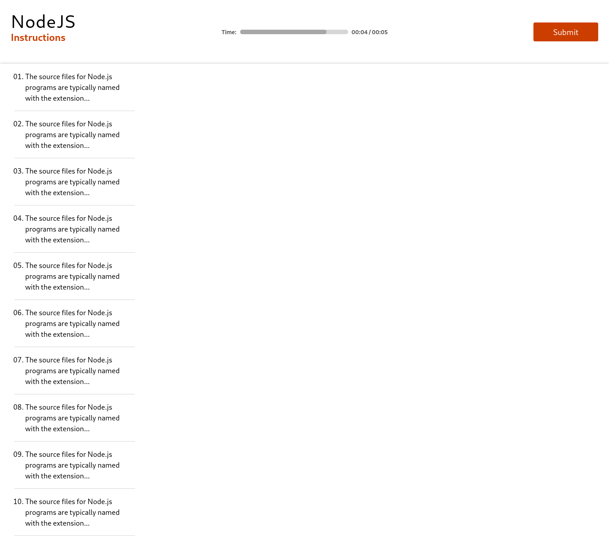
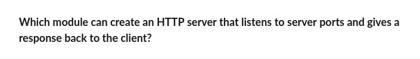
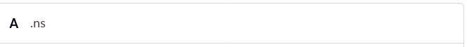
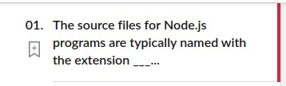
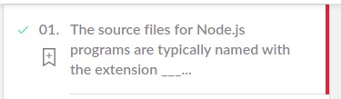
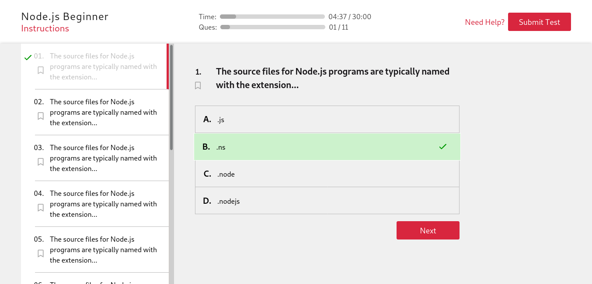

Going down with this article you will be creating a `MainContainer` that will consist of a __List__ of questions to be asked in this `QuizMe` application as:



So, let's have setup some sub-directories for our new components as:
```
src/components/
├── List                        List component for questions
│   ├── List.css
│   └── List.js
├── MainContainer               MainContainer component to have a GridContainer component
│   ├── GridContainer.css
│   └── GridContainer.js
├── question.json               JSON file containing an array of questions
```
Let's focus on the `List` component first.
## List
Now get started with its component file
- Import React
- Import CSS file
- Create a functional component
  - Export this component as default
> **src/components/List/List.js**
```js
import React from "react";
import "./List.css";

function List(props) {
    return (
        <div className="ordered-list">
            <li>
                {props.content}
            </li>
        </div>
    )
}

export default List;
```
Here we are returning a JSX element consisting:

* `div` element with class name "ordered-list"
  * `list li`
    * content (will receive from _props_) to be written inside the list

Now its time to style our `List` component as:
> **src/components/List/List.css**
```css
.ordered-list {
    padding: 1rem;
    padding-left: 1.5rem;
    border-bottom: 1px solid var(--lightGrey);
}

.ordered-list li {
    font-size: 1rem;
    color: var(--dark);
    cursor: pointer;
}
```
Till here you have made a list component that you want to call inside your ordered-list for each and every question. So let's have an array of questions in a JSON file as:
> **src/comopnents/question.json**
```js
[
    {
        "question": "The source files for Node.js programs are typically named with the extension...",
        "options": [
            ".js",
            ".ns",
            ".node",
            ".nodejs"
        ]
    },
    {
        "question": "The source files for Node.js programs are typically named with the extension...",
        "options": [
            ".js",
            ".ns",
            ".node",
            ".nodejs"
        ]
    },
    {
        "question": "The source files for Node.js programs are typically named with the extension...",
        "options": [
            ".js",
            ".ns",
            ".node",
            ".nodejs"
        ]
    },
    {
        "question": "The source files for Node.js programs are typically named with the extension...",
        "options": [
            ".js",
            ".ns",
            ".node",
            ".nodejs"
        ]
    },
    {
        "question": "The source files for Node.js programs are typically named with the extension...",
        "options": [
            ".js",
            ".ns",
            ".node",
            ".nodejs"
        ]
    },
    {
        "question": "The source files for Node.js programs are typically named with the extension...",
        "options": [
            ".js",
            ".ns",
            ".node",
            ".nodejs"
        ]
    },
    {
        "question": "The source files for Node.js programs are typically named with the extension...",
        "options": [
            ".js",
            ".ns",
            ".node",
            ".nodejs"
        ]
    },
    {
        "question": "The source files for Node.js programs are typically named with the extension...",
        "options": [
            ".js",
            ".ns",
            ".node",
            ".nodejs"
        ]
    },
    {
        "question": "The source files for Node.js programs are typically named with the extension...",
        "options": [
            ".js",
            ".ns",
            ".node",
            ".nodejs"
        ]
    },
    {
        "question": "The source files for Node.js programs are typically named with the extension...",
        "options": [
            ".js",
            ".ns",
            ".node",
            ".nodejs"
        ]
    }
]
```
Now, it's time to make a grid-container where you will make a grid column of `300px` and will put an ordered-list of questions there as:
## GridContainer
Get started with the component file
- Import React
- Import CSS file
- Import `List` component
- Create a functional component
  - Create a function which will take an array of `Questions` as the input parameter and will return a list of `List` component with each of them having a proper and unique `key` attribute
  - Export this component as default
> **src/components/MainContainer/GridContainer**
```js
import React from "react";
import "./GridContainer.css";
import List from "../List/List";

function GridContainer (props) {

    function listOfQuestion(Questions){
        return Questions.map((question, index) => 
            <List key={index + question.question.length} content = {question.question} />
        )
    }

    return (
        <section className="grid-container">
            <aside>
                <ol>
                    {listOfQuestion(props.Questions)}
                </ol>
            </aside>
        </section>
    )
}

export default GridContainer;
```
Here we are returning a JSX element consisting:
- `div` element with class name "grid-container"
  - `ol` ordered-list element
    - A list of `List` components corresponding to each question coming from the __props__
    - > __Mention that for each `List` component in Question mapping we have given it a unique `key` as a combination of `index` and `length` of question. If you left with nothing in order to assign a unique key to the list then only you should go for the index value__

Let's do some styling on this component as:
> **src/components/MainContainer/GridContainer.css**
```css
.grid-container {
    display: grid;
    grid-template-columns: 300px;
    box-shadow: 0 0 0.4rem 0 rgb(200, 200, 200);
}

.grid-container ol {
    padding-left: 2rem;
    list-style-type: decimal-leading-zero;
}
```
Now it's time to implement this `GridContainer` component in our application as:
## Implementation
- Import the `GridContainer` component
- Import the questions from the JSON file
- Make call to `GridContainer` component after `Navbar` component
- Since ___`A JSX expression must have only one parent element`___ and here, there are two of them as `Navbar` and `GridContainer` hence, encapsulate both of these elements inside another `div` element in accordance with the aforementioned rule.
> **src/index.js**
```js
...
import GridContainer from "./components/MainContainer/GridContainer"
import Questions from "./components/question.json"
...
class App extends React.Component {
    render() {
        return (
            <div>
                <Navbar title="NodeJS" />
                <GridContainer Questions={Questions} />
            </div>
        )
    }
}
...
```
Hurray, here you have been completed with this `List` and `MainContainer` component for listing questions. You can run this command to start your server and check it on your browser screen:
> **`npm start`**


# Task
Coming to the task part, you have to make the main container with two columns one for the list of questions (`_aside_`) and another for displaying the question currently selected along with its option to choose.

So here are some basic components in order to complete it as
## Para component


* Tag - p
* color- #19171a
* font-size - 1.2rem
* props - { para : PropTypes.string }
## Ordered List component
* Tags - ol
* Attribute (type) - {number: **1**(type-value), alphabet: **A**(type-value)}
* type - {action, directory}
## List component
* Tag - li
* padding - 0.7rem
* font-size - 1.2rem
* border- 1px solid #BBBBBB
* props - {option : PropTypes.string}
* type - {action  , directory }

* action 


* directory 
  1. unchecked
  
  
  2. checked
  
## Input component
* Tag - input
* placeholder color - #B8B8B8
* padding- 0.6rem
* placeholder font-size - 1.1rem
* border - 1px solid #BBBBBB
* type- {text,file,labeled-checkbox,labeled-radio}

* labeled-radio

## ActionList Component
* Tag - li
* ol attribute - **type** should have a value of "**A**"
* border - 1px solid #BBBBBB
* color - #838082
* padding - 0.7rem 0.5rem;

# Final view
At last, your Application should look like this:


## Introduction to activity
